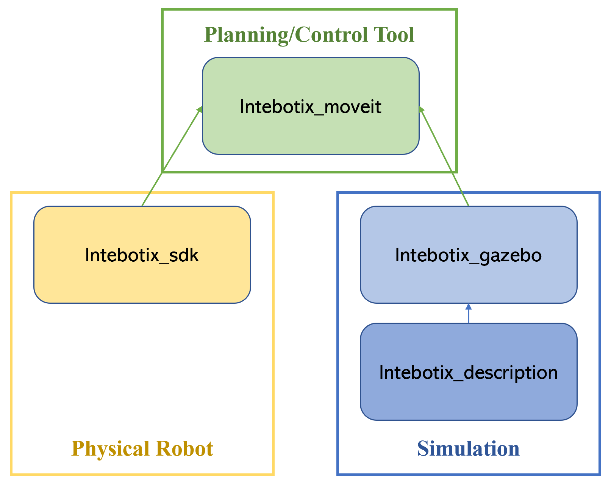
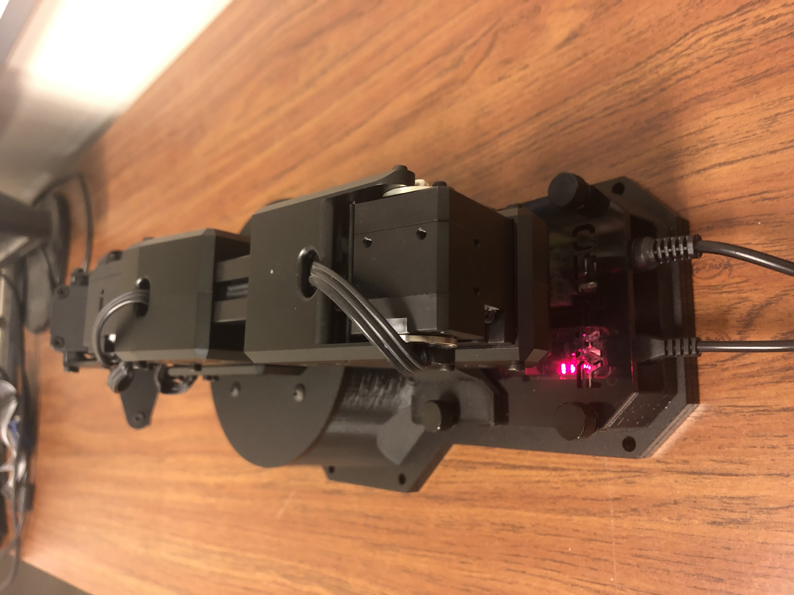
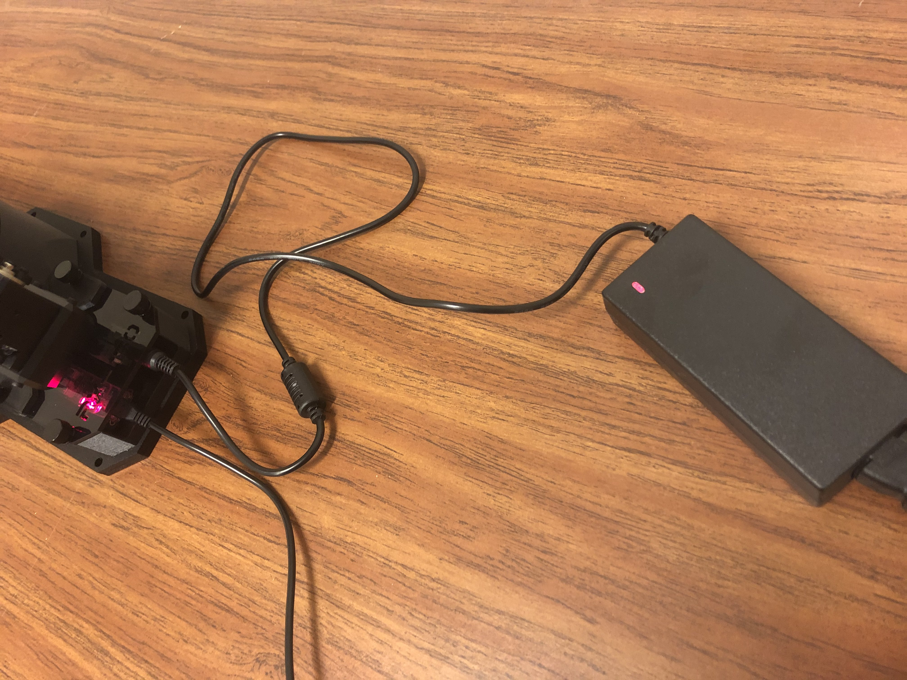
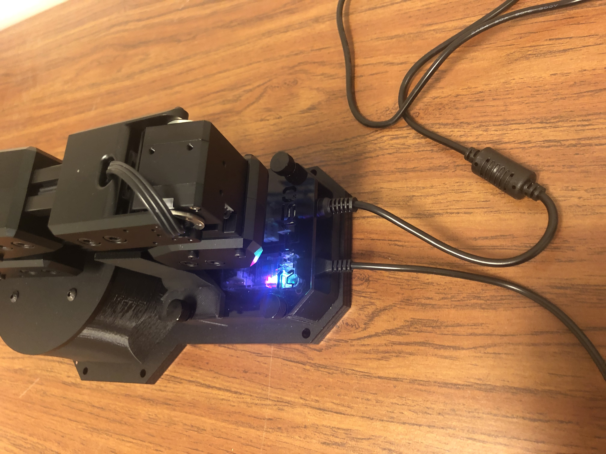
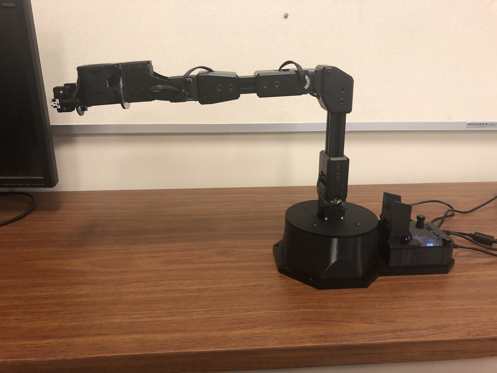
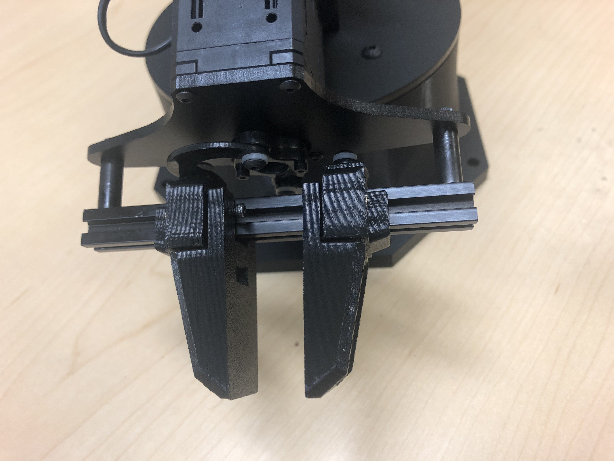
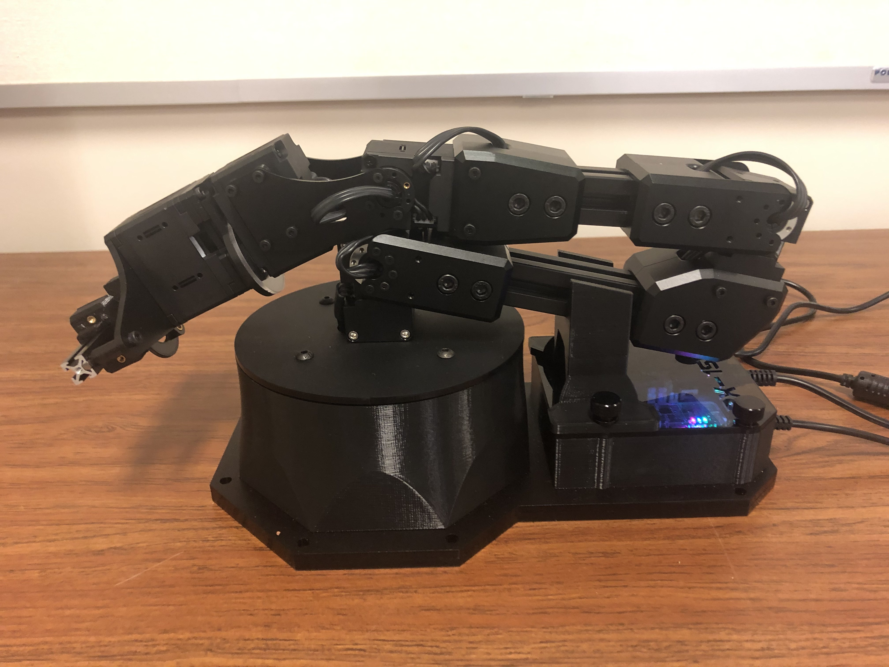

ReactorX 150 Manipulator
=========================

Overview
--------------------------
The ReactorX 150 Robot Arm belongs to a new family of arms from interbotix. 
It equips with 4 links, 4 joints and a gripper. 
The arm has a 45cm horizontal reach from center of the base to gripper with a total span of 90cm.
The working payload for it is 100g and more information could be found at `ReactorX 150 Manipulator`_.

.. _ReactorX 150 Manipulator: https://www.trossenrobotics.com/reactorx-150-robot-arm.aspx

We could easily communicate with the ReactorX 150 Robot Arm via ROS and required ROS packages could be downloaded from `intebotix_ros_arm`_.

    
The relation among the four core packages in the repo could be illustrated in the figure.
Firstly, ``interbotix_descriptions`` contains the files to describe (define or create) the model of this specific robot arm in simulators (e.g., Gazebo).
Then together with the model information, ``interbotix_gazebo`` includes config files and completes the process to launch the robot arm in Gazebo.
So you could simulate the robot arm using these two packages.
On the other hand, ``interbotix_sdk`` is responsible for driving the physical robot.
Finally, ``interbotix_moveit`` builds on top of the ``interbotix_descriptions``, ``interbotix_gazebo`` and ``interbotix_sdk`` packages.
It is a well-defined tool to do trajectories planning and achieve a particular arm/gripper pose.
So you can publish your desired poses to the node ``move_group`` and moveit helps you plan a smooth trajectory.

.. _intebotix_ros_arm: https://github.com/Interbotix/interbotix_ros_arms

Installation of the Software
----------------------------

1) If you don't have the `catkin workspace`_ in your laptop, 
open a terminal and run the following code to create a new workspace called ``catkin_ws``

.. _catkin workspace: https://wiki.ros.org/catkin/workspaces

.. code-block:: bash

    $ mkdir -p ~/catkin_ws/src
    $ cd ~/catkin_ws/
    $ catkin_make
    $ source ~/catkin_ws/devel/setup.bash
    $ echo "source ~/catkin_ws/devel/setup.bash" >> ~/.bashrc

2) Go to your ``src`` directory and clone the repository

.. code-block:: bash

    $ cd ~/catkin_ws/src
    $ git clone https://github.com/Interbotix/interbotix_ros_arms.git

3) Install all the required dependencies and build your workspace

.. code-block:: bash

    $ cd ~/catkin_ws
    $ rosdep update
    $ rosdep install --from-paths src --ignore-src -r -y
    $ sudo apt install python-pip
    $ sudo pip install modern_robotics
    $ catkin_make

Now you have downloaded all the components to play with the robot arm. 
You could try some examples in `intebotix_ros_arm`_ while don't forget to set the ``robot_name`` as ``rx150``.

Using Moveit to Achieve a Desired Arm/Gripper Pose
---------------------------------------------------

As we mentioned in the intro, `Moveit`_ is a tool to generate a smooth trajectory for the robot arm achieving a desired pose.
The `intebotix_ros_arm`_ provides you the interface, so you could utilize Moveit in either Gazebo, actual robot or a fake robot created by RViz.
Here we will introduce how to move the robot arm/gripper in Gazebo.

.. _Moveit: http://docs.ros.org/en/kinetic/api/moveit_tutorials/html/index.html

1. Launch the ReactorX 150 robot arm in Gazebo and Moveit by the following command.

.. code-block:: bash
    
  roslaunch interbotix_moveit interbotix_moveit.launch robot_name:=rx150 use_gazebo:=true

2. Click on the **Play ▶ button** in Gazebo to unpause the simulation. 
You could also open a terminal and run ``rosservice call /gazebo/unpause_physics`` to achieve it.
Then you will see the robot arm in RViz (the visualization software used in ROS).

3. Once the RViz starts, you can see two panels. 
  
  - If you want to control the robot arm,  
    firstly on the top left panel, go to ``MotionPlanning`` -> ``Planning Request`` -> ``Planning Group``
    and choose the group ``interbotix_arm``. On the same panel, go to ``Query Goal State`` and check this box. 
    Then you can drag the "ball" on the tip of the robot arm to your desired arm pose. 
    Once a goal pose is set, in the bottom left panel, go to the "Planning" tab and try buttons ``Plan``, ``Execute``, or ``Plan and Execute``. 
    The software will figure out a path for the arm to follow and reach the exact goal pose you just set.

  - If you want to move the gripper, go to ``MotionPlanning`` -> ``Planning Request`` -> ``Planning Group``
    and choose the group ``interbotix_gripper``. 
    There are a few saved poses for the "gripper" group, e.g., open, close, home, etc.
    So you could select the start as well as the goal states from these saved poses.
    On the bottom left panel ("MotionPLanning"), go to ``Planning`` -> ``Query`` and choose the initial and desired pose.
    Don't forget to click on ``update`` once you make a new selection.
    Finally, click on ``Plan and Execute``, you will see the gripper moves.

4. Now, you can take a look at Gazebo and you will find the robot is at the states
you just set in RViz.  

Access to Lab and Lab Safety
----------------------------

We put some `ReactorX 150 Manipulator`_ robots in WCH 128. 
So to use them, you just need to follow the regular procedure required by campus to access the lab room.
That is:

1) Enter your names for particular days/times in the Google Drive `room reservation`_ file. 
Please make sure there are no more than 6 students having the same reservation.

2) Before you actually head to the lab room, please complete the `symptom survey`_ first.

3) If that's your first time to use the arm, please contact TA to be assigned to a robot arm.
Then in the following quarter, you will be responsible for that robot and you could use it anytime as long as you get the approval to the lab room.

4) When you are at the room, you should scan the 2-D QR code at the door and when you are leaving,
you also need to scan the QR code to complete your visit.

5) Note that whenever a lab is used, its work area, instruments and accessories should be completely cleaned, wiped and disinfected.
The lab provides all necessary wipes, solutions and disinfectants, 
so when you are at lab please wash/wipe your hands often, disinfect anything you touch and use,
wear masks, keep safe distaning and take all other precautions to prevent the spread of the virus.

Finally, keep in mind that: YOUR SAFETY IS THE MOST IMPORTANT THING!

.. _room reservation: https://docs.google.com/spreadsheets/d/19ZxRzmm3Tmzi93cMewLDc0Fjmm24Ri7Q
.. _symptom survey: https://ucriverside.az1.qualtrics.com/jfe/form/SV_cOB8gBU6OVulQax 

Hardware Setup
--------------

Most of the setup of the robot arm is ready. You just need to power it and connect it to your laptop.

1) Remove the robot arm from its package and place it on a sturdy and flat surface.
Also make sure that there are no obstacles within the workspace of the arm or turret.

2) Plug the 12V power cable into an outlet and insert the barrel plug into the barrel jack on the X-series power hub.
Then plug the micro-usb cable into your computer and the other side into the U2D2. 
Both of the two ports are located under the see-through acrylic on the base of the robot.
Now you should see the LEDs flash red as shown in the following figures.

Get Started with the Physical Robot
-----------------------------------

Now you are ready to play with the real robot.
Here we still use Moveit to help us achieve the desired pose of arm or gripper.

1) Launch the driver node of the actual robot and the Moveit

.. code-block:: bash
    
  roslaunch interbotix_moveit interbotix_moveit.launch robot_name:=rx150 use_actual:=true dof:=5

You should see the light color changes and all the motors in the robot are torqued on..
If you want to manually manipulate the initial position, you could run
``$ rosservice call /rx150/torque_joints_off`` in another terminal. 
Be aware that it will cause the robot to collapse so manually hold the arm before executing it. 
Once you move the robot manually to your desired initial pose, hold it and run
``$ rosservice call /rx150/torque_joints_on`` to torqued on motors again.

2) Now you could play with Moveit on your laptop to plan the trajectory (e.g., "home" state as shown) as aforementioned.
Just note to avoid collisions when you set the goal states and during the planning.
(You could run ``plan`` to see how it will perform and then ``Execute``). 

3) The current arm is not equipped with gripper fingers so you could attach any kind of it for your project.
We provide one type of the fingers in the box. You can easily equip it in the way as shown in the figures.

4) When you are done with your work, please put the arm back safely for further use. 
Firstly, run ``$ rosservice call /rx150/torque_joints_off`` to torque off the motors, 
please be very careful as the arm will collapse once you run the command. 
So you should hold the arm manually before it falls down.
Then manually put it back to the safe position as illustrated.
Finally, shut down (ctrl C) your launch process and unplug the power cords.

YOUR SAFETY IS THE MOST IMPORTANT THING. Please stay safe and have fun with the robots!

