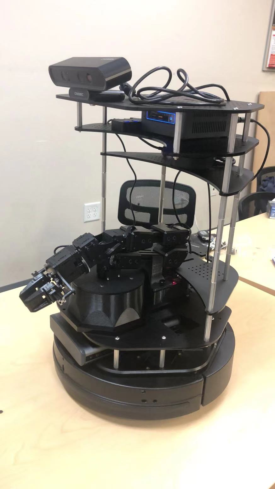
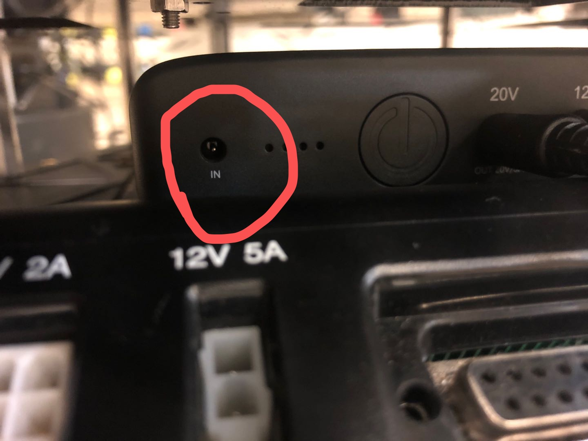
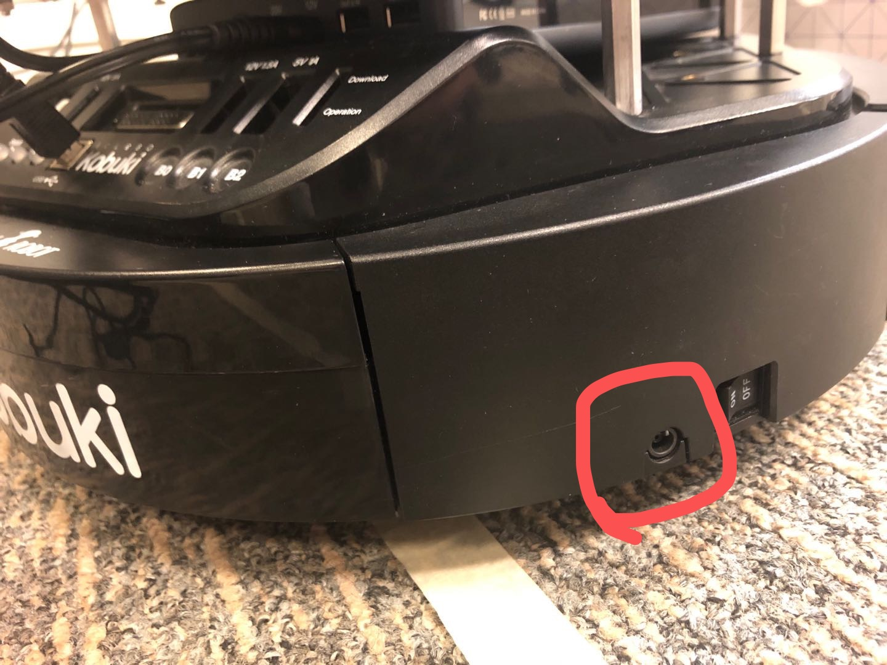

Mobile Robot Arm
================

Overview
--------

The mobile robot arm is equipped with the `Kobuki Mobile Base`_, the Intel NUC PC, the `ReactorX 150 Robot Arm`_, the `Orbbec 3D Camera`_ and the `RPLidar`_.
All the required repositories are downloaded and tested in the NUC so you can play with it directly.

.. _Kobuki Mobile Base: http://kobuki.yujinrobot.com/about2/

.. _Orbbec 3D Camera: http://wiki.ros.org/astra_camera

.. _ReactorX 150 Robot Arm: https://www.trossenrobotics.com/reactorx-150-robot-arm.aspx

.. _RPLidar : http://wiki.ros.org/rplidar

Access to Lab and Lab safety
-----------------------------

We put two mobile robot arms in WCH 126. So to use them, you just need to follow the regular procedure required by campus to access the lab room. That is:

1. Enter your names for particular days/times in the Google Drive `room reservation`_ file. 
Please make sure there are no more than 6 students having the same reservation.

2. Before you actually head to the lab room, 
please complete the `symptom survey`_ first.

3. If that's your first time to use the arm, please contact TA to be assigned to a robot arm. 
Then in the following quarter, you will be responsible for that robot and you could use it anytime as long as you get the approval to the lab room.

4. When you are at the room, you should scan the 2-D QR code at the door and when you are leaving, 
you also need to scan the QR code to complete your visit.

5. Note that whenever a lab is used, its work area, 
instruments and accessories should be completely cleaned, 
wiped and disinfected. The lab provides all necessary wipes, solutions and disinfectants, 
so when you are at the lab please wash/wipe your hands often, disinfect anything you touch and use, wear masks, 
keep safe distancing and take all other precautions to prevent the spread of the virus.

Finally, keep in mind that: YOUR SAFETY IS THE MOST IMPORTANT THING!

.. _room reservation: https://docs.google.com/spreadsheets/d/19ZxRzmm3Tmzi93cMewLDc0Fjmm24Ri7Q
.. _symptom survey: https://ucriverside.az1.qualtrics.com/jfe/form/SV_cOB8gBU6OVulQax 

Get Started with the Physical Robot
-----------------------------------

1) Prepare a monitor, a mouse and a keyboard (you might find them in the lab, otherwise you need to prepare them yourself).

2) Connect the monitor to the HDMI port of the NUC and the mouse as well as the keyboard could be connected to the 4-port USB hub.

3) Now turn on the battery, the base, and the NUC. You are ready to play with the robot.
  
  - To launch the mobile base and sensors (camera and lidar) on the real robot, run ``roslaunch ee175 bringup.launch``. 
  
  - To visualize the data from camera and lidar, run ``roslaunch ee175 rviz.launch``. (Note that you need to run the bringup.launch first)
  
  - To launch and use the arm, refer to the tutorial for `arm`_. (Note the software is ready and you don't need to download again)
  
    .. _arm: https://ucr-robotics.readthedocs.io/en/latest/aram/manipulator.html
  
4) Charge the base and the battery when they need. The ports' locations are shown as follows. 

    
Notes
-----

1) The manipulator and camera must directly connect to the onboard computer (rather than indirectly via USB hub). Please do not change this setup.

2) For the safety purpose, please double check if the joint angles are valid (i.e. it will not cause the crash) before sending commands to the manipulator.

3) If the arm gets crashed, hold the arm manually and run ``$ rosservice call /rx150/torque_joints_off`` in a new terminal immediately to avoid burning the arm. 

4) When you start to run the mobile base, put the whole robot on the ground instead of the table.
    
    
