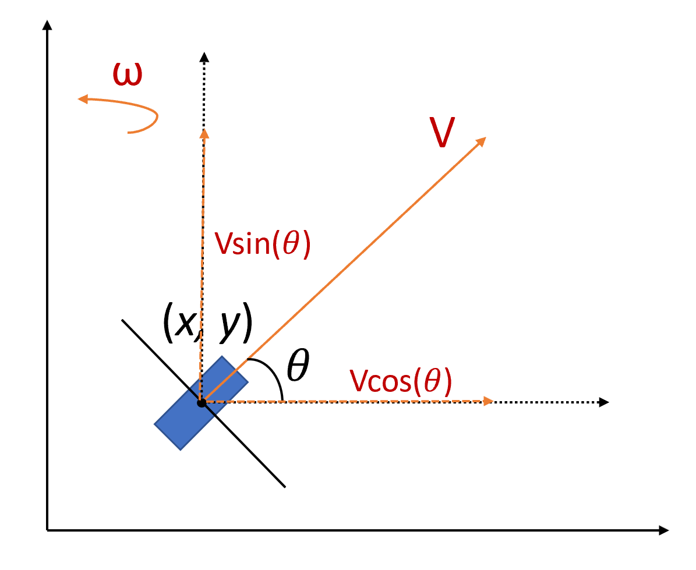
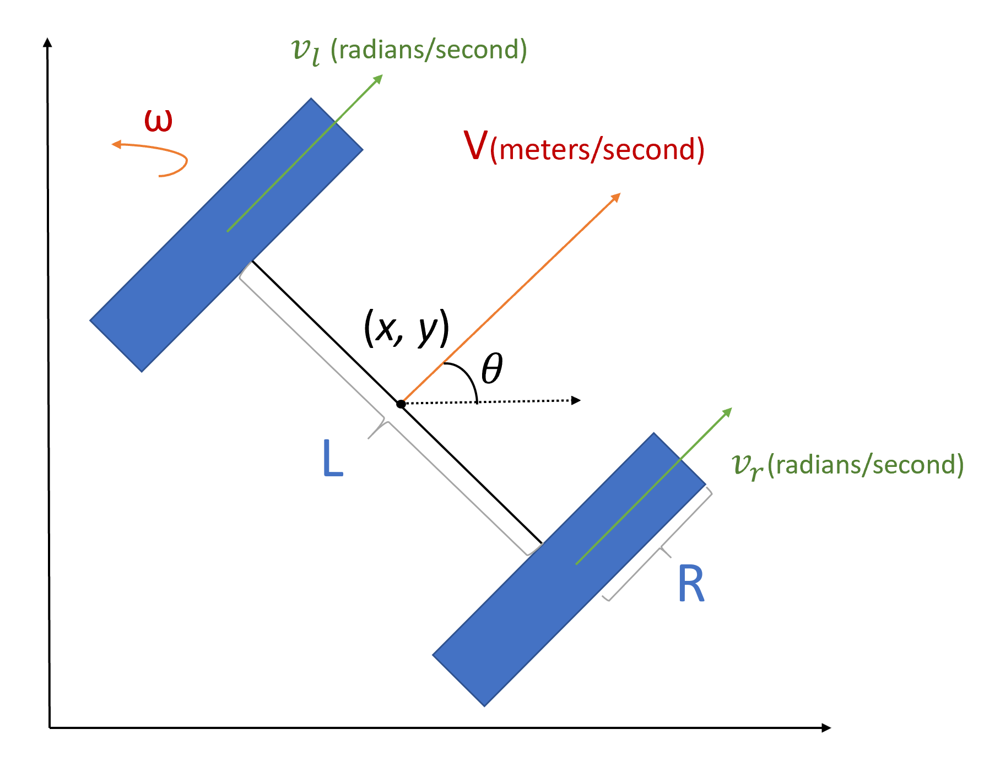
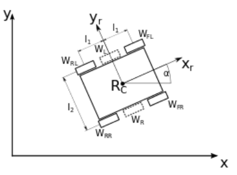
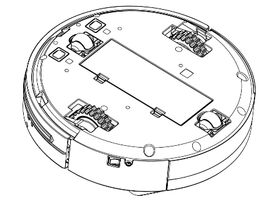
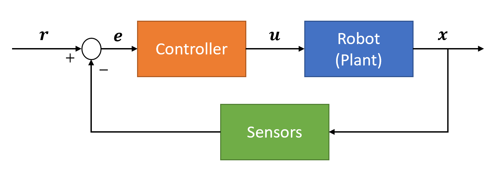
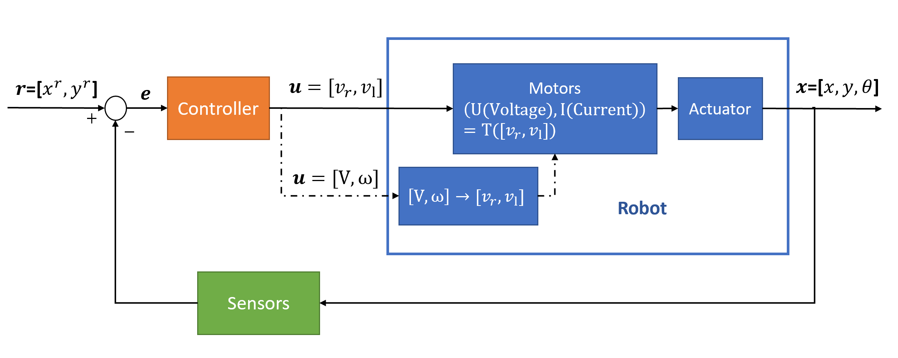

Kinematics and Control for Wheeled Robots
====================

A wheeled robot refers to that operates in contact with the ground and its movement is based on separately driven wheels placed on either side of the robot body.
It can thus change its direction by varying the relative rate of rotation of its wheels.
Generally speaking, no matter how many wheels it has, the speed of each side will be the same value separately. 
So all the wheeled robots could be treated as the differential-drive robot with two wheels.
In this tutorial, we will introduce how to do modeling and basic control ideas for wheeled robots.
  
    
Review on State-space Model
--------

In control engineering, a `state-space representation`_ is a mathematical model of a physical system as a set of input, output and state variables related by first-order differential equations or difference equations. The values of state variables will evolve over time depending on the input variables.
It is a good tool (modelling method) to show how system variables (e.g., position, velocity, angle, ect.) are affected by internal or external inputs (e.g., forces, moments, etc.) over time.

You could choose different subsets of system variables to represent the entire state of the system, 
while the smallest possible subset is the minimum number of state variables that could fully represent the given physical system. 
In a robotic system, this minimum number is always related to the degree of freedoms of the robot. 
The states typically include the configuration (position) and its derivative (velocity). 

.. _state-space representation: https://en.wikipedia.org/wiki/State-space_representation
   
   
- State-Space Modelling Steps

  - Given a set of differential equations (take a single variable :math:`q(t)` as an example here)
  - Isolate the n-th highest derivative, :math:`q^{(n)} = g(q,\dot{q},\dots,q^{(n-1)},\mathbf{u})`
  - Set :math:`x_{1} = q(t)`, :math:`x_{2} = \dot{q}(t)`, :math:`\dots` , :math:`x_{n} = q^{(n-1)}(t)`.
  - Create state vector :math:`\mathbf{x} = [x_1,x_2,\dots,x_n]^T = [q, \dot{q},\dots,q^{(n-1)}]^T`
  - Rewrite these equations into a system of coupled first-order differential equations and (optional) rewrite in matrix form:
 
.. math::

    \begin{array}{c}
    \dot{x}_{1}=\dot{q}=x_{2} \\
    \dot{x}_{2}=\ddot{q}=x_{3} \\
    \dots \\
    \ddot{x}_{n}=q^{(n)}=g\left(q, \dot{q}, \ldots, q^{(n-1)}, \mathbf{u}\right)=g\left(x_{1}, x_{2}, \ldots, x_{n}, \mathbf{u}\right)
    \end{array} \to

.. math::

    \left [\begin{array}{c}
    \dot{x}_{1} \\
    \dot{x}_{2} \\
    \dots \\
    \dot{x}_{n}
    \end{array}\right]=
    \left [\begin{array}{l}
    x_{2} \\
    x_{3} \\
    \dots \\
    g\left(x_{1}, x_{2}, \ldots, x_{n}, \mathbf{u}\right)
    \end{array}\right]

Now we could express the evolution of the system use :math:`n` states :math:`\mathbf{x} \in R^{n}` and :math:`m` inputs :math:`\mathbf{u} \in R^{m}`.
    

State-space Model for Mobile Robot
-----------------------------------------

    
When we treat the robot as having only one wheel (or being only a simple point), we could get the unicycle model as shown in the figure. 
The states :math:`x`, :math:`y` are position of the centroid of the robot and :math:`\theta` is the heading angle.
Thus in the global coordinate frame, we can represent the state-space model of the unicycle robot as: 
    
.. math::

    \left [\begin{array}{c}
    \dot{x} \\
    \dot{y} \\
    \dot{\theta}
    \end{array}\right]=
    \left [\begin{array}{c}
    V\cos{\theta} \\
    V\sin{\theta} \\
    \omega
    \end{array}\right]    

It describes how the states of a wheeled robot (:math:`x`, :math:`y`, :math:`\theta`) are propagating over time with the inputs (linear velocity V and angular velocity :math:`\omega`).
This kind of modelling doesn't include the details of the original robot (e.g., how many wheels it has, what's the size of the robot, ect.), 
while it is simple and suitable for designing controllers. 

    
When you want to simulate and test your control algorithm in a wheeled robot system, the model is enough.
While if you are designing your own physical robot and want to know the true inputs to wheels, you will need the differential-drive robot.    
The differential-drive is a two-wheeled drive system with independent actuators. 
Two drive wheels are usually placed on each side of the robot and towarding the front is treated as the positive direction.
It has the same states (:math:`x`, :math:`y`, :math:`\theta`) as the unicycle model while its inputs are the velocity of the left (:math:`v_l`) and right (:math:`v_r`) wheels.
To go from the unicycle model to the differential-drive model, we will show how to relate these two sets of inputs.

- Firstly, note that :math:`v_l` and :math:`v_r` have units of radians/second, so the linear velocity of each wheel are obtained by multiplying by the radius of wheels :math:`R` as :math:`R v_l` and :math:`R v_r`. Then recall that the kinematics of directional drive systems gives us the forward and rotational displacement of the robot within a short time interval based on the displacement of the left and right wheels. The forward velocity V is calculated as the average of the wheel velocities

.. math::

    V = \frac{R}{2}(v_r+v_l)

- The rotational velocity is the difference of the wheel velocities divided by the radius of rotation. In robotics literature, the radius of rotation is :math:`L`, or the distance between the wheels. One way to think of this is to consider the case when the left wheel is stopped while the right wheel moves forward. The robot will rotate about the left wheel making an arc with radius of :math:`L`. So the angular velocity could be expressed as

.. math::

    \omega = \frac{R}{L}(v_r-v_l)
    
Thus, the differential-drive model is:

.. math::

    \left [\begin{array}{c}
    \dot{x} \\
    \dot{y} \\
    \dot{\theta}
    \end{array}\right]=
    \left [\begin{array}{c}
    \frac{R}{2}(v_r+v_l)\cos{\theta} \\
    \frac{R}{2}(v_r+v_l)\sin{\theta} \\
    \frac{R}{L}(v_r-v_l)
    \end{array}\right]    

As aforementioned, when the velocities of wheels on one side are the same, we could model the system as a two-wheel differential-drive robot no matter how many wheels it has.
For that case, we could create one virtual wheel to replace all the wheels on one side. 
Its radius :math:`R` is calculated as the distance between origin of the farthest wheel and center of the side as the `example`_ shown as follows.

   
.. _example: https://husarion.com/tutorials/ros-tutorials/3-simple-kinematics-for-mobile-robot/

There are other cases that some wheels are only for support.

Control of the Wheeled Robots
-----------------------------

- Feedback control

Control systems attempt to influence the state of a system towards a desired configuration. 
A basic idea of it is to compare the desired trajectory with the measured outputs (states) and make corresponding corrections.
Those control methods which will utilize the current measurements for correction are called closed-loop control (or feedback control) as shown in the following figure.

  - The state, or output of the system is :math:`\mathbf{x}`. The state of the system depends on its previous state, the stimulus applied to the actuators and the physics of the robot’s environment.

  - We can not determine :math:`\mathbf{x}` exactly, but can estimate it using sensors. We hope that our sensors are good enough to reasonably estimate what the robot actually does and the "state estimation" is another direction of research.

  - The desired set point, also called a reference, is :math:`r`.

  - The error between the reference and estimated system state is :math:`e`, which is the input to the controller.

  - The output of the controller is the control Signal :math:`u`, which is the stimulus to the system.

  - The dynamics of the system is called the system plant.

The procedure applied in the differential-drive robots are shown as follows. 

    
Here we explain the variable and extend the block for "robot". 
The inputs of the robot depends on your controller while the motor will "translate" your designed velocity to voltage and (or) current.
Then the power is given to the actuator to drive your robot.

- PID Controller

The Proportional-Integral-Deritive (PID) controller is the most frequently-used feedback controller.
It helps the robot to follow the desired trajectory by minimizing the error. 
The details and programming tips for PID are listed in: https://ucr-ee144.readthedocs.io/en/latest/lab3.html .
Please read it carefully and here we will introduce some tips on tuning the parameters :math:`K_D`, :math:`K_P`, :math:`K_I`.

  - Criterion: the criterion for choosing the parameters are shown as follows. The other figure shows how to obtain these criteria when you give inputs to drive the system achieving the desired point.
  
  .. image:: figures/criterion.png
    :width: 80%
    
  .. image:: figures/response.png
    :width: 80%  
  
  - Ziegler-Nichols Method for tuning
  
    1) Set :math:`K_D = K_I = 0`
    
    2) Increase :math:`K_P` until ultimate gain :math:`K_u` where system starts to oscillate
    
    3) Find oscillation period :math:`T_u` at :math:`K_u`
    
    4) Set gains according to the following table
    
    .. image:: figures/parameter.png
      :width: 50%

  
 

